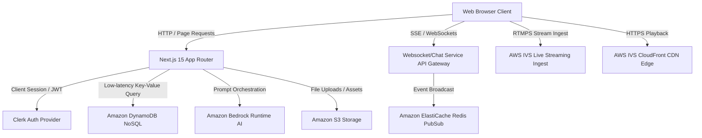

# CodeLive Architecture & System Design

This document details the production-grade architecture of **CodeLive**, a highly scalable live-coding platform designed to support millions of concurrent users.

---

## 1. High-Level Architecture Overview

CodeLive leverages a hybrid Serverless/Edge-native model with Next.js 15, coupled with specialized managed services for media distribution, security, storage, and database indexing.

---

## 2. Infrastructure Stack & Scalability Choices

### 2.1 Low-Latency Streaming (AWS Interactive Video Service)
* **Ingest (RTMPS)**: Streamers broadcast using standard streaming software (OBS, Streamlabs) directly to IVS ingest endpoints.
* **Egress (HLS / Low-Latency Egress)**: Video distribution uses AWS IVS CDN edge networks (powered by CloudFront) to achieve sub-2-second latency globally.
* **Scale**: AWS IVS handles dynamic transcoding (1080p, 720p, 480p) out-of-the-box and scales to millions of viewers per channel natively.

### 2.2 Scaling Chat & Realtime updates (WebSockets / Server Sent Events)
* HTTP polling is banned for message feeds at scale. CodeLive will support:
  * **WebSocket Connections** handled by AWS API Gateway or a specialized microservice.
  * **Redis Pub/Sub** (Amazon ElastiCache) to broadcast stream messages across distributed server nodes.
  * Virtualized React rendering to maintain 60 FPS client execution during high-frequency chat bursts (e.g., 20k messages/sec).

### 2.3 Highly Indexed Database Layer (Amazon DynamoDB)
* **Single-Table Design**: We utilize DynamoDB's NoSQL model to achieve sub-10ms query times at any scale.
* **Partition Keys (PK) & Sort Keys (SK)**:
  * **User Profile**: `PK: USER#<userId>`, `SK: METADATA`
  * **Community Guild**: `PK: COMMUNITY#<communityId>`, `SK: DETAILS`
  * **Active Streams**: `PK: STREAMS`, `SK: LIVE#<streamId>` (Global Secondary Index GSI for filtering active vs offline streams).
  * **Chat Message history**: `PK: STREAM#<streamId>#CHAT`, `SK: MSG#<createdAt>#<messageId>` (Optimized for range-key query sorted by time).

### 2.4 LLM Assistant (Amazon Bedrock)
* LLM requests (e.g., code explainers) are executed using **Bedrock Runtime** with model streams (SSE) to prevent blocking main process threads.
* Implements token limits and strict user rate-limiting to prevent vendor API exhaustion.

---

## 3. Security & Auth Flow

* **Clerk Auth**: Handles user sign-in, MFA, session tracking, and JWT signatures.
* **Edge Validation**: Client-sent Clerk JWT token signature validated instantly in Next.js Middleware before triggering serverless function invocations.
